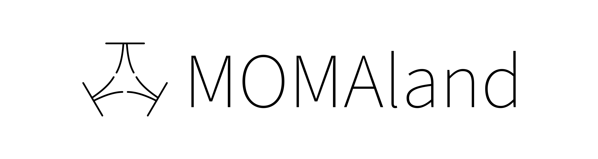

[](https://badge.fury.io/py/momaland)
[](https://badge.fury.io/py/momaland)

[](https://pre-commit.com/)
[](https://github.com/psf/black)

<p align="center">
    
</p>

<!-- start elevator-pitch -->
MOMAland is an open source Python library for developing and comparing multi-objective multi-agent reinforcement learning algorithms by providing a standard API to communicate between learning algorithms and environments, as well as a standard set of environments compliant with that API. Essentially, the environments follow the standard [PettingZoo APIs](https://github.com/Farama-Foundation/PettingZoo), but return vectorized rewards as numpy arrays instead of scalar values.

The documentation website is at https://momaland.farama.org/, and we have a public discord server (which we also use to coordinate development work) that you can join [here](https://discord.gg/bnJ6kubTg6).
<!-- end elevator-pitch -->

## Environments
MOMAland includes environments taken from the MOMARL literature, as well as multi-objective version of classical environments, such as SISL or Butterfly.
The full list of environments is available at https://momaland.farama.org/environments/all-envs/.

## Installation
<!-- start install -->
To install MOMAland, use:
```bash
pip install momaland
```
This does not include dependencies for all components of MOMAland (not everything is required for the basic usage, and some can be problematic to install on certain systems).
- `pip install "momaland[testing]"` to install dependencies for API testing.
- `pip install "momaland[learning]"` to install dependencies for the supplied learning algorithms.
- `pip install "momaland[all]"` for all dependencies for all components.
<!-- end install -->

## API
<!-- start snippet-usage -->
Similar to [PettingZoo](https://pettingzoo.farama.org), the MOMAland API models environments as simple Python `env` classes. Creating environment instances and interacting with them is very simple - here's an example using the "momultiwalker_stability_v0" environment:

```python
from momaland.envs.momultiwalker_stability import momultiwalker_stability_v0 as _env
import numpy as np

# .env() function will return an AEC environment, as per PZ standard
env = _env.env(render_mode="human")

env.reset(seed=42)
for agent in env.agent_iter():
    # vec_reward is a numpy array
    observation, vec_reward, termination, truncation, info = env.last()

    if termination or truncation:
        action = None
    else:
        action = env.action_space(agent).sample() # this is where you would insert your policy

    env.step(action)
env.close()

# optionally, you can scalarize the reward with weights
# Making the vector reward a scalar reward to shift to single-objective multi-agent (aka PettingZoo)
# We can assign different weights to the objectives of each agent.
weights = {
    "walker_0": np.array([0.7, 0.3]),
    "walker_1": np.array([0.5, 0.5]),
    "walker_2": np.array([0.2, 0.8]),
}
env = LinearizeReward(env, weights)
```

For details on multi-objective multi-agent RL definitions, see [Multi-Objective Multi-Agent Decision Making: A Utility-based Analysis and Survey](https://arxiv.org/abs/1909.02964).

You can also check more examples in this colab notebook! [](https://colab.research.google.com/github/Farama-Foundation/momaland/blob/main/momaland_demo.ipynb)
<!-- end snippet-usage -->

## Learning Algorithms
<!-- start learning-algorithms -->
We provide a set of learning algorithms that are compatible with the MOMAland environments. The learning algorithms are implemented in the [learning/](https://github.com/Farama-Foundation/momaland/tree/main/momaland/learning) directory. To keep everything as self-contained as possible, each algorithm is implemented as a single-file (close to [cleanRL's philosophy](https://github.com/vwxyzjn/cleanrl/tree/master)).

Nevertheless, we reuse tools provided by other libraries, like multi-objective evaluations and performance indicators from [MORL-Baselines](https://github.com/LucasAlegre/morl-baselines).

Here is a list of algorithms that are currently implemented:

| **Name**                                                                                                                                                                                                                                                            | Single/Multi-policy | Reward     | Utility             | Observation space | Action space | Paper |
|---------------------------------------------------------------------------------------------------------------------------------------------------------------------------------------------------------------------------------------------------------------------|---------------------|------------|---------------------|-------------------|--------------|-------|
| MOMAPPO (OLS) [continuous](https://github.com/Farama-Foundation/momaland/blob/main/momaland/learning/continuous/cooperative_momappo.py),<br/> [discrete](https://github.com/Farama-Foundation/momaland/blob/main/momaland/learning/discrete/cooperative_momappo.py) | Multi               | Team       | Team / Linear       | Any               | Any          |       |
| [Scalarized IQL](https://github.com/Farama-Foundation/momaland/tree/main/momaland/learning/iql)                                                                                                                                                                     | Single              | Individual | Individual / Linear | Discrete          | Discrete     |       |
| [Centralization wrapper](https://github.com/Farama-Foundation/momaland/blob/main/momaland/utils/parallel_wrappers.py#L149)                                                                                                                                          | Any                 | Team       | Team / Any          | Discrete          | Discrete     |       |
| [Linearization wrapper](https://github.com/Farama-Foundation/momaland/blob/main/momaland/utils/parallel_wrappers.py#L49)                                                                                                                                            | Single              | Any        | Individual / Linear | Any               | Any          |       |


<!-- end learning-algorithms -->

## Environment Versioning
MOMAland keeps strict versioning for reproducibility reasons. All environments end in a suffix like "_v0".  When changes are made to environments that might impact learning results, the number is increased by one to prevent potential confusion.

## Development Roadmap
We have a roadmap for future development available [here](https://github.com/Farama-Foundation/momaland/issues/56).

## Project Maintainers
Project Managers:  Florian Felten (@ffelten)

Maintenance for this project is also contributed by the broader Farama team: [farama.org/team](https://farama.org/team).

## Citing
<!-- start citation -->
If you use this repository in your research, please cite:
```bibtex
@misc{felten2024momaland,
      title={MOMAland: A Set of Benchmarks for Multi-Objective Multi-Agent Reinforcement Learning},
      author={Florian Felten and Umut Ucak and Hicham Azmani and Gao Peng and Willem Röpke and Hendrik Baier and Patrick Mannion and Diederik M. Roijers and Jordan K. Terry and El-Ghazali Talbi and Grégoire Danoy and Ann Nowé and Roxana Rădulescu},
      year={2024},
      eprint={2407.16312},
      archivePrefix={arXiv},
      primaryClass={cs.MA},
      url={https://arxiv.org/abs/2407.16312},
}
```
<!-- end citation -->

## Development
### Setup pre-commit
Clone the repo and run `pre-commit install` to setup the pre-commit hooks.
